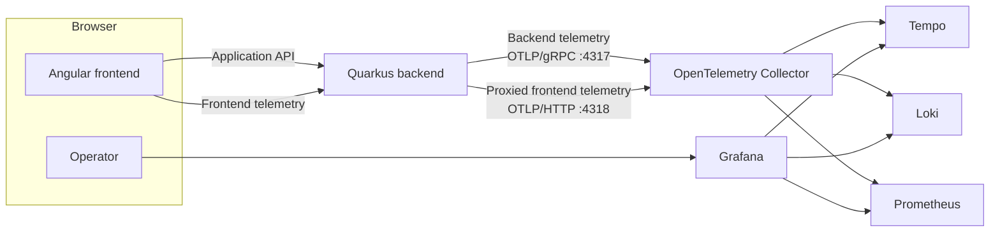

# Service Utils, Full-Stack Observability

A full-stack application demonstrating end-to-end observability across an Angular frontend and a Quarkus backend using OpenTelemetry and the Grafana observability stack.

The project demonstrates distributed tracing, metrics and logs across the frontend and backend, including trace-context propagation between the browser and the backend. The Quarkus backend also acts as a telemetry proxy, allowing frontend telemetry to reach the OpenTelemetry Collector without exposing the Collector directly to the public network.

[](https://angular.dev/)
[](https://www.typescriptlang.org/)
[](https://quarkus.io/)
[](https://www.java.com/)
[](https://opentelemetry.io/)
[](https://playwright.dev/)
[](https://www.docker.com/)

## Architecture

### Runtime Architecture



The Angular frontend sends application requests and telemetry through the Quarkus backend. Backend telemetry is exported directly to the OpenTelemetry Collector over OTLP/gRPC, while frontend telemetry is received by the backend and forwarded to the Collector over OTLP/HTTP.

Grafana provides access to the resulting traces, logs and metrics.

Grafana is available at [http://localhost:3000](http://localhost:3000)


## Project Structure

The project is organized into two application components:

```text
Observability/
│
├── frontend/                   Angular frontend
│   ├── docs/                   Frontend observability screenshots
│   ├── e2e/                    Playwright end-to-end tests
│   ├── public/                 Public resources
│   ├── scripts/                General scripts
│   ├── src/                    Angular application
│   └── README.md               Frontend presentation
│
├── backend/                    Quarkus backend
│   ├── docs/                   Backend observability screenshots
│   ├── src/
│   │   ├── main/
│   │   │   ├── java/           Backend application
│   │   │   └── resources/      Backend application configuration
│   │   └── test/
│   │       ├── java/           Backend unit and end-to-end tests
│   │       └── resources/      Backend test configuration
│   ├── .mvn/
│   |   └── wrapper/
│   └── README.md               Backend presentation
│
└── README.md                   ← project-level documentation
```

## Running the Application
### Prerequisites
The following are required:

- Docker
- Java
- Node.js and npm

Docker must be running because Quarkus in development mode launches the observability services as containers.

### Start the Backend
From the project root:

```bash
cd backend
mvnw quarkus:dev
```

The backend application becomes available at `http://localhost:8080`.

In development mode, Quarkus automatically launches the observability services through DevServices.

### Start the Frontend

In a separate terminal:

```bash
cd frontend
npm install
npm start
```

The frontend application becomes available at [http://localhost:4200](http://localhost:4200).

## Observability

The project follows an OpenTelemetry-based observability model covering three complementary telemetry signals:

- **Traces** — follow user operations across the Angular frontend and Quarkus backend.
- **Metrics** — measure application health, performance, traffic and frontend user-perceived performance.
- **Logs** — provide detailed contextual information for diagnosing application behavior and failures.

Telemetry is correlated across frontend and backend through W3C trace context propagation. When an API request is initiated within a frontend span, the trace context is propagated to the Quarkus backend through the `traceparent` HTTP header, allowing the complete operation to be followed as a single distributed trace.

For the browser-based SPA (*Single Page Application*), health is inferred from telemetry such as page-load success, navigation success and latency, JavaScript errors and Web Vitals rather than from traditional liveness/readiness probes.

### Frontend Telemetry Proxy

Because the Angular application runs in the user's browser, directly exporting telemetry would require exposing the OpenTelemetry Collector to the public internet. Instead, frontend telemetry is sent to the Quarkus backend through OTLP-compatible endpoints, and the backend forwards it to the Collector.

This architecture keeps the Collector on the internal observability network while allowing the frontend to use standard OpenTelemetry telemetry formats. The backend proxy can additionally enforce platform controls such as rate limiting and admission policies.

### Testing
#### Frontend

From the frontend directory, run unit tests with:

```bash
npm test
```

Run the Playwright end-to-end tests with:

```bash
npm run e2e
```

> These end-to-end tests require the backend to be up and running. 

#### Backend

From the backend directory, run unit tests with:

```bash
mvnw test
```

Integration tests can be executed with:

```bash
mvnw failsafe:integration-test
```

The complete backend verification can be run with:

```bash
mvnw verify
```

## Documentation

Detailed documentation is available for each application component:

- [Angular frontend](frontend/README.md) — frontend application, testing and frontend observability
- [Quarkus backend](backend/README.md) — REST API, backend telemetry, telemetry proxy and observability

The frontend and backend READMEs contain detailed information about their respective telemetry, testing, API and observability features.