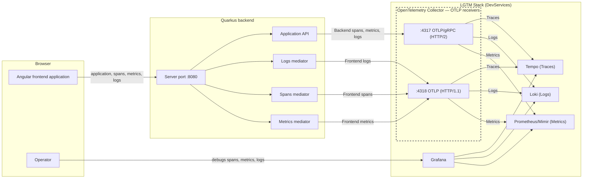
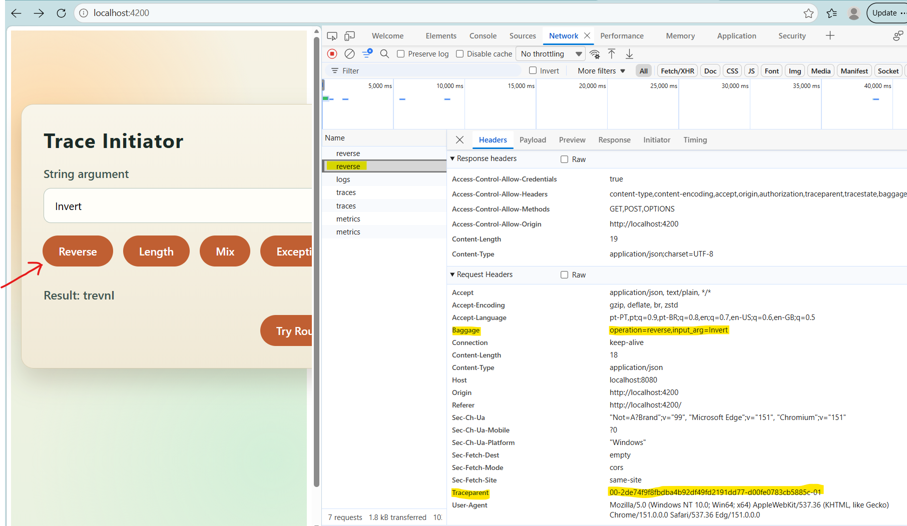
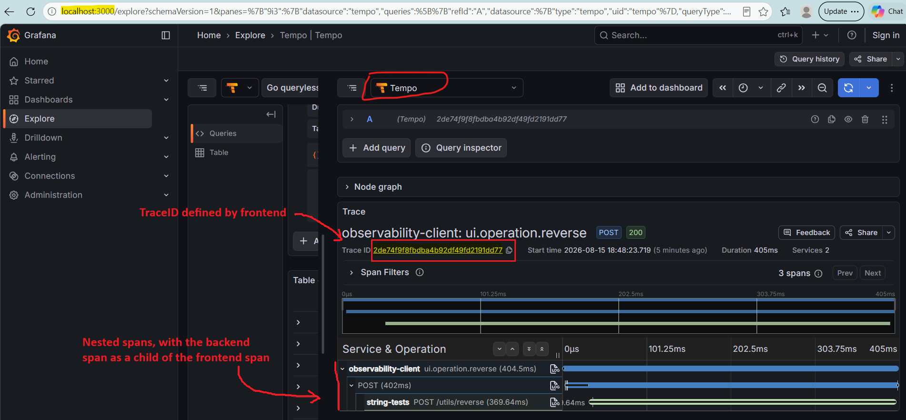
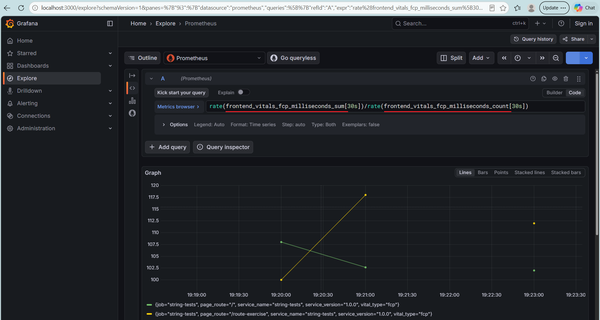
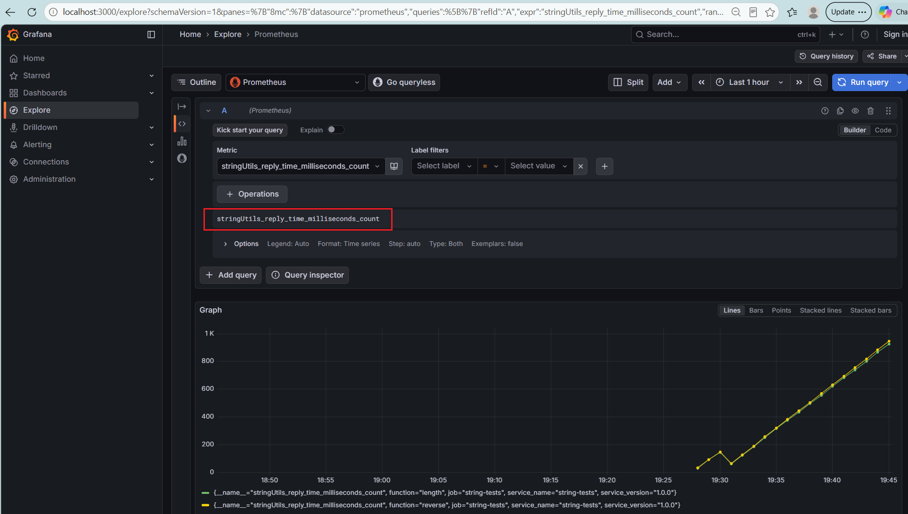
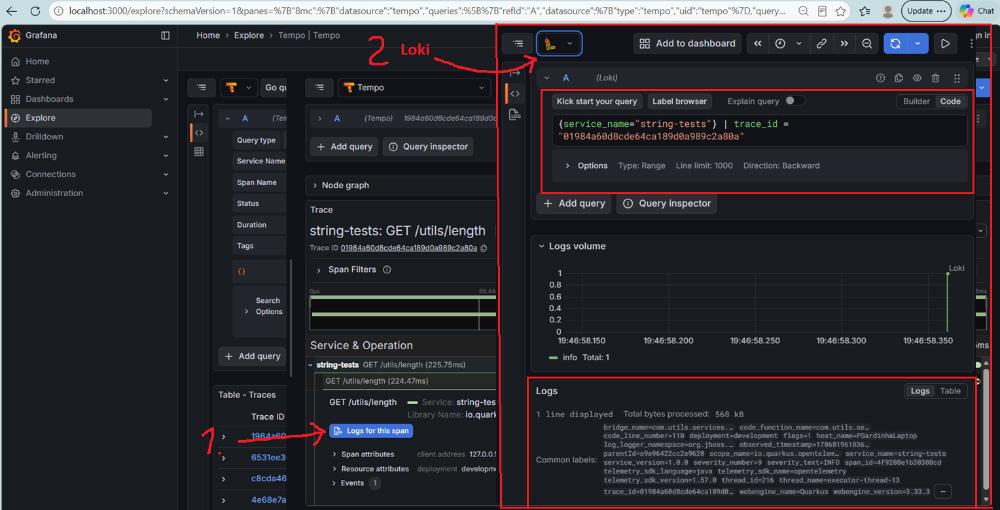

# Service Utils, a String Reversal and String Length service with Telemetry

A simplified Quarkus-based microservice providing REST endpoints for string manipulation and demonstrating end-to-end observability with OpenTelemetry.

The project instruments both backend and Angular frontend activity, propagates distributed trace context between them and uses the Quarkus backend as a telemetry proxy so that frontend telemetry can reach the OpenTelemetry collector without exposing the collector directly to the public network. Traces, logs and metrics are visualized through the **Grafana**, using **Tempo** for traces, **Loki** for logs and **Prometheus** for metrics.

[](https://www.java.com/)
[](https://quarkus.io/)
[](https://opentelemetry.io/)
[](https://grafana.com/)
[](https://grafana.com/oss/tempo/)
[](https://grafana.com/oss/loki/)
[](https://prometheus.io/)

## Features

- Simple REST API for string reversal
- Accepts a string and returns it with character positions reversed
- Example: "ABC123" becomes "321CBA"
- OpenTelemetry instrumentation for traces, metrics and logs
- Frontend telemetry proxying through the Quarkus backend
- Grafana-based observability through the LGTM stack

## Architecture



**Telemetry flow**: The Angular application sends API requests and frontend telemetry to the Quarkus backend. The backend executes the business operation and exports its own telemetry to the OpenTelemetry Collector over OTLP/gRPC on port 4317, while frontend telemetry is proxied through the backend over OTLP/HTTP to port 4318. This allows frontend and backend telemetry to participate in the same observability architecture without exposing the Collector directly to the internet. Grafana provides access to the resulting traces, logs and metrics.

**Metrics backend**: The DevServices setup can use Prometheus or Mimir as the Prometheus-compatible metrics backend.

Port 4317 is used for telemetry generated by the backend because:

- It uses OTLP/gRPC over HTTP/2.
- Payloads use binary Protocol Buffers (Protobuf) encoding.
- Protobuf generally provides compact and efficient serialization.
- HTTP/2 supports multiplexing multiple concurrent streams over a single connection.
- The combination of gRPC, HTTP/2 and Protobuf is well suited to efficient, high-volume telemetry export.

Port 4318 is also available and is used by the telemetry proxy to forward frontend-generated telemetry. Although frontend telemetry could theoretically be converted and forwarded through port 4317, doing so would require the proxy to decode the incoming OTLP payload and export the resulting telemetry through an OTLP/gRPC exporter.

---
## Observability

The application instruments its API operations for end-to-end observability, allowing browser telemetry to reach the OpenTelemetry Collector without exposing the Collector directly to the public network.

### LGTM Stack
The application uses the LGTM Stack for observability:

- Grafana — dashboards and visualization
- Tempo — distributed traces and spans
- Loki — application logs
- Prometheus (or Mimir) — Prometheus-compatible metrics backend
- OpenTelemetry Collector — receives and routes telemetry to the appropriate LGTM backend

The OpenTelemetry Collector exposes two OTLP endpoints:

- Port 4317 — OTLP/gRPC over HTTP/2
- Port 4318 — OTLP/HTTP over HTTP/1.1

The backend's OpenTelemetry SDK uses port 4317 for telemetry export; the custom frontend telemetry proxy forwards OTLP/HTTP payloads to port 4318.

Grafana is available at `http://localhost:3000`.

### Dev UI

Dev UI: `http://localhost:8080/q/dev-ui`

In the Dev UI, navigate to the Observability section:

- Grafana: View dashboards and explore logs (Loki), traces (Tempo) and metrics (Prometheus).
- Traces: Select Explore → data source Tempo → query traces by service name string-tests.
- Metrics: Select Explore → data source Prometheus → query metrics using PromQL.

OTel configuration in application.properties:

- Service name: string-tests
- Traces: enabled with the always_on sampler
- Metrics and logs: enabled
- Context propagation: tracecontext and baggage
- OTLP exporter: enabled using gRPC over HTTP/2 at `http://localhost:4317`
- Grafana: available on port 3000.
- OTLP proxy: forwards telemetry received through /otel/v1/traces, /otel/v1/metrics and /otel/v1/logs to http://localhost:4318.
- Trace suppression: application spans are not created for the OTLP proxy endpoints.
- Log correlation: traceId and spanId are included in the console log format.

### Observability Examples

The application demonstrates:

- Distributed tracing across Angular and Quarkus.
- Trace context propagation from the browser to the backend.
- Baggage propagation of frontend operation context.
- Correlation of application logs with trace and span IDs.
- Custom frontend and backend metrics.
- Web Vitals collection from the frontend.
- Error tracing and metric recording for failed API operations.

#### Distributed tracing

The following image shows a trace initiated by the frontend application:



As the request is processed, the backend generates its own telemetry and proxies the frontend's telemetry to the OpenTelemetry Collector. The resulting spans, belonging to the same trace, are collected and made available in Tempo:



#### Metrics

Both frontend-specific metrics, such as FCP (*First Contentful Paint*),



and backend metrics



are visible in Grafana.

#### Logs and trace correlation

From span analysis, it is possible to navigate directly to the logs generated within the span's scope:



Logs can also be listed and inspected independently of traces.

---

## Running the Application

> **Important:** Start Docker first as Quarkus in development mode launches LGTM stack as containers.

Move to Quarkus backend project directory:

```bash
cd backend
```

Compile and run unit tests:

```bash
mvnw test
```

Run integration tests exclusively:

```bash
cd vehicle-diagnostics-st
mvnw failsafe:integration-test
```

Alternatively, one can compile, package and run unit and integration tests with a single command:

```bash
mvnw verify
```

Once the tests have passed, Quarkus backend application can be launched in development mode:

```bash
mvnw quarkus:dev
```

If the `make.load` system property is enabled, the application continuously generates random requests to its API. The delay between consecutive requests follows a uniform distribution over `[0, 250 ms[`:

```bash
mvnw -Dmake.load quarkus:dev
```

The backend application becomes available at `http://localhost:8080` in live reload mode.
In development mode, Quarkus additionally, because of its project dependencies on Observability, automatically launches the backend Observability applications.

## API Endpoints

| Method | Endpoint        | Description         |
|--------|-----------------|---------------------|
| `POST` | `/utils/reverse`| Reverse a string    |
| `GET`  | `/utils/length` | Length of a string  |
| `GET`  | `/q/dev-ui`     | Dev UI              |
| `GET`  | `/q/swagger-ui` | Swagger (see above) |            

The operations can be experimented in a swagger interface at `http://localhost:8080/q/swagger-ui`.

> To simulate an API failure, the string reversal operation throws an exception when the input is `"ERROR"` (case-insensitive). The exception is handled by the API and results in an HTTP 400 response:

```json
{
  "message":"Input cannot be 'ERROR'"
}
```

### Health Checks

- Liveness: `GET /q/health/live`
- Readiness: `GET /q/health/ready`


## Further Steps

As an optimization experiment, the `OtelSignalForwarder` could be updated to forward frontend telemetry through the Collector's OTLP/gRPC endpoint on port 4317.

The current `HttpClient`-based proxy forwards the browser's OTLP/HTTP payloads directly to port 4318. Using port 4317 would require decoding the incoming OTLP protobuf payloads and re-exporting the resulting traces, metrics and logs through dedicated OTLP/gRPC exporters.

The existing `/otel/v1/traces`, `/otel/v1/metrics` and `/otel/v1/logs` endpoints could remain unchanged for the Angular frontend.