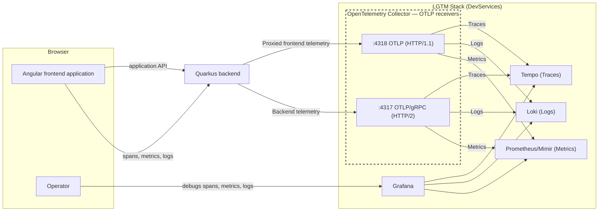
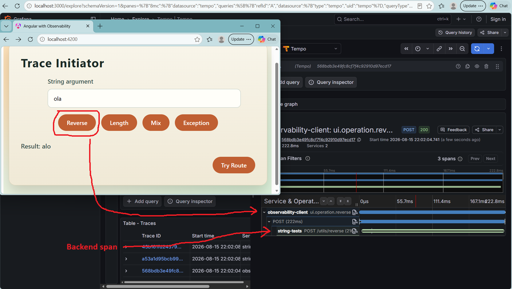

# Angular Frontend

This project is an Angular frontend application that communicates with a Quarkus backend and demonstrates end-to-end observability using OpenTelemetry.

The application instruments frontend activity with distributed traces, metrics and logs, propagates trace context to the backend, collects frontend health and performance signals and forwards its telemetry through the Quarkus backend without exposing the OpenTelemetry Collector directly to the public network.

This project was generated using [Angular CLI](https://github.com/angular/angular-cli) version 21.2.19.

[](https://angular.dev/)
[](https://www.typescriptlang.org/)
[](https://opentelemetry.io/)
[](https://playwright.dev/)

## Architecture

The frontend communicates with the Quarkus backend for both application requests and telemetry. The backend forwards its own telemetry to the OpenTelemetry Collector over OTLP/gRPC and proxies frontend telemetry over OTLP/HTTP.



Frontend and backend telemetry therefore reach the same observability stack through different OTLP paths, while the Angular application never communicates directly with the collector.

## Running the Application

Start by moving to the frontend directory:

```bash
cd frontend
```

### Install dependencies

To install all project dependencies, run

```bash
npm install
```

### Running unit tests

Execute the unit tests with:

```bash
npm test
```

### Running End-to-end Tests

Execute the end-to-end tests with:

```bash
npm run e2e
```
> These end-to-end tests require the backend to be up and running. 

### Run the Frontend in Development mode

Start the local development server with:

```bash
npm start
```

Once the server is running, open your browser and navigate to `http://localhost:4200/`. 

The application will automatically reload whenever you modify any of the source files.


### Building

To build the project run:

```bash
npm run build
```

The build artifacts are generated in the `dist/` directory. The production build is optimized for performance and size.

## Observability

Unlike backend services, browser-based frontend applications do not expose native liveness and readiness probes. Frontend health is therefore inferred from telemetry collected during normal application use (Real User Monitoring, RUM).

Frontend telemetry is correlated with backend telemetry through OpenTelemetry trace-context propagation, with the trace context propagated through the traceparent HTTP header, allowing a user operation to be followed across the browser and Quarkus backend.

The application tracks page-load success, navigation success, navigation latency and JavaScript errors as practical indicators of frontend health.


### Frontend health signals

| Signal | Metric | Description |
|--------|--------|-------------|
| **Boot health** | `frontend_page_load_total{status="success\|error"}` | Records whether Angular bootstrapping completes successfully |
| **Navigation health** | `frontend_route_change_total{status="success\|error"}` | `NavigationEnd` is recorded as success and `NavigationError` as an error; cancelled navigations are excluded |
| **Navigation performance** | `frontend_route_change_duration_ms` | Measures the time from `NavigationStart` to `NavigationEnd` |
| **JavaScript stability** | `frontend_js_errors_total` | Captures `window.onerror` and `window.onunhandledrejection` |

The frontend also collects multiple Web Vitals, including FCP (*First Contentful Paint*), to provide user-perceived performance measurements.

These signals provide four complementary views of frontend health:

- **Boot health** — can the application start successfully?
- **Usability** — can users navigate successfully?
- **Performance** — how quickly do navigations complete?
- **Stability** — are JavaScript errors occurring?

Example alerting criteria include:

- Page-load success rate below 99% over 5 minutes
- Route-change error rate above 2%
- Route-change P95 duration above 2 seconds
- JavaScript error rate above 0.5% over 10 minutes
- JavaScript error rate above 1% over 5 minutes

### Telemetry proxy

Frontend telemetry is sent through the Quarkus backend rather than directly to the OpenTelemetry Collector. The backend acts as a telemetry proxy, receiving standard OpenTelemetry telemetry and forwarding the signals to the Collector.

Telemetry generated before user authentication is still useful for observing application startup, authentication and other pre-authentication activity.

Consequently, the backend telemetry proxy endpoints do not require user authentication, but are protected with rate-limiting controls.

### Observability examples

An example of frontend-initiated distributed trace and frontend/backend trace correlation follows:

